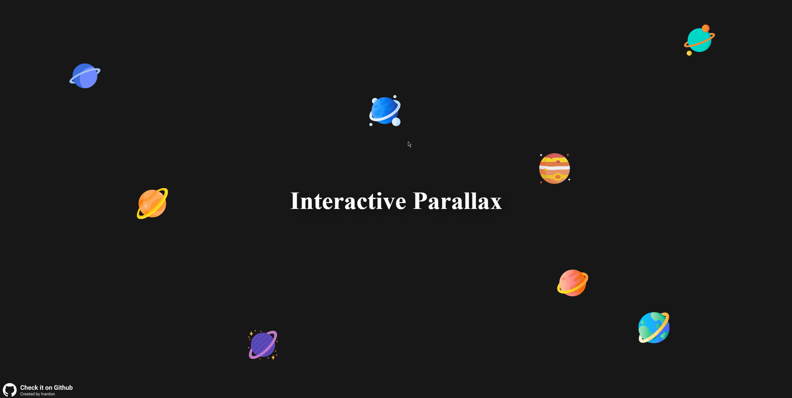

# Interactive Parallax

A module to create a parallax that interacts with the mouse move.

[](https://www.npmjs.com/package/interactiveparallax) [](https://standardjs.com)

## Demo

<p align="center" >
  
</p>

Live Demo [Here](https://lnardon.github.io/InteractiveParallax/ "Interactive Parallax Demo")

## Installation

```bash
npm install interactiveparallax
```

## Usage

```ts
import useParallax from "animationsequence";

useParallax(containerClass: string, targetClass: string, alertMobileUser?: boolean)
```

## Example

```js
import useParallax from "animationsequence";

useParallax("parallaxContainer", "planetImage", true);
```

The function accepts 3 arguments:

- The class name of the container where the parallax will happen
- The class name of the targets to apply the effect
- A optional argument to inform in case the device has no support for the package.
